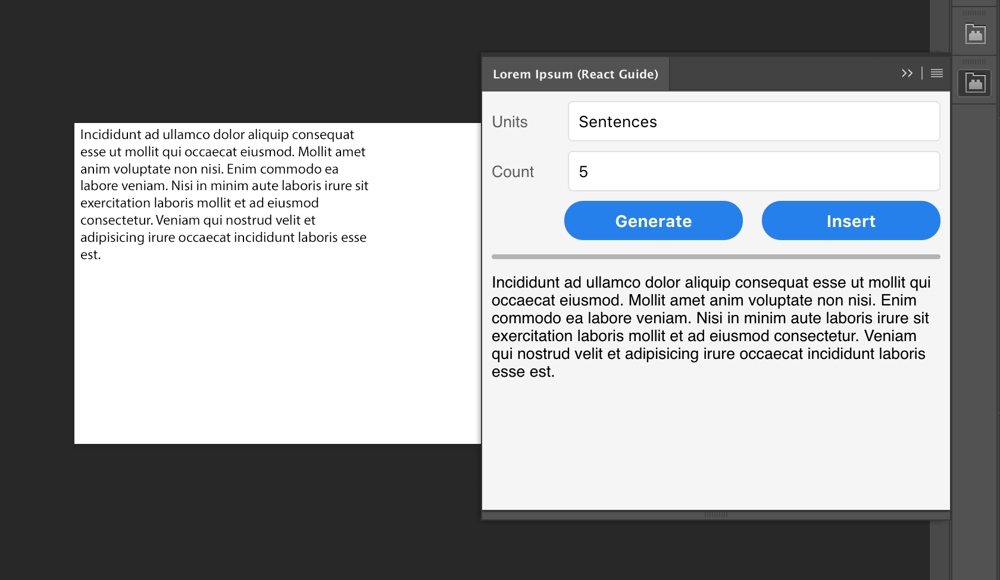

# Building CEP Panels with React

When you build Adobe CEP panels, you're using nearly the very same technologies you would on the web, including HTML, CSS, and JavaScript. In recent years, various JavaScript UI frameworks and libraries like React, Angular, and Vue.js have risen to prominence and introduced a sea change in how modern web applications are built. Because Adobe CEP relies on an embedded Chromium webview which supports modern web technologies, the question naturally arises: _Can you use a modern JavaScript UI framework or library with Adobe CEP_?

The answer is _yes_! You can indeed use any Javascript UI framework or library you want with Adobe CEP. The catch, of course, is always in the details. Because Adobe CEP is _framework agnostic_ (it doesn't care which framework you use), we'll focus on using one of the most popular UI libraries: React. However, it's important to remember that you aren't limited to using React. You can use similar techniques to get Angular or Vue.js panels running as well.

In this guide, then, we'll be showing you _how_ you can use the React JavaScript framework to build CEP panels. By the end of this guide, we will have an panel that:

1.  Demonstrates how to set up your React CEP project
2.  Renders a simple user interface using React
3.  Interacts with a host application using ExtendScript

Before we go any further, it might be useful to show you what our panel will actually look like.



You can see the panel on the far right side of the image. This panel's user interface isn't amazingly complex by any stretch of the imagination, but it is being rendered with React and some simple CSS.

As you might be able to tell, the panel itself just generates some "lorem ipsum" content. The user can choose whether they want "paragraphs", "sentences", or "words", and they can then choose how much content they want. Clicking **Generate** will create a preview of that in the bottom of the panel &mdash; and the user can click that as many times as they want to get different output.

When the user clicks the **Insert** button, the panel communicates with Photoshop via ExtendScript and passes in the text. The ExtendScript code creates a new text layer and adds the content into the active document.

<!-- START doctoc generated TOC please keep comment here to allow auto update -->
<!-- DON'T EDIT THIS SECTION, INSTEAD RE-RUN doctoc TO UPDATE -->
**Contents**

1. [GitHub](#github)
1. [Technology Used](#technology-used)
1. [Prerequisites](#prerequisites)
1. [Configuration](#configuration)
    1. [Scaffolding your project](#scaffolding-your-project)
        1. [Create the project's root folder](#create-the-projects-root-folder)
        1. [Create `package.json`](#create-packagejson)
        1. [Create directories](#create-directories)
    1. [CEP-specific configuration](#cep-specific-configuration)
        1. [Adding `CSInterface.js`](#adding-csinterfacejs)
        1. [Configuring `manifest.xml`](#configuring-manifestxml)
        1. [Configuring .debug](#configuring-debug)
    1. [Installing npm dependencies](#installing-npm-dependencies)
        1. [Installing React](#installing-react)
        1. [Installing Babel](#installing-babel)
        1. [Installing Webpack](#installing-webpack)
        1. [Installing Lorem Ipsum](#installing-lorem-ipsum)
    1. [Configuring Webpack](#configuring-webpack)
    1. [Configuring Build Scripts](#configuring-build-scripts)
1. [Creating our user interface](#creating-our-user-interface)
1. [Interacting with the host application](#interacting-with-the-host-application)
1. [Customization](#customization)
1. [Best Practices](#best-practices)
1. [Troubleshooting and Known Issues](#troubleshooting-and-known-issues)
1. [Resources and References](#resources-and-references)
    1. [NOTES](#notes)

<!-- END doctoc generated TOC please keep comment here to allow auto update -->

## GitHub

You can find a companion GitHub repo for this developer guide [on GitHub](<!LINK HERE>). The project doesn't ship with any installed dependencies, so you'll need to follow the "Configuration" steps below to properly install and configure the project.

## Technology Used

*   Supported Host Applications: Photoshop
*   Libraries/Frameworks/APIs:
    *   Adobe-specific: [CEP](https://github.com/Adobe-CEP/CEP-Resources/tree/master/CEP_8.x)
    *   Other: [Node.js](https://nodejs.org/en/), [NPM](http://npmjs.com/)
        *   Frameworks: [React](https://reactjs.org)
        *   Webpack:
            * [Webpack](https://webpack.js.org/)
            * [CopyWebpackPlugin](https://webpack.js.org/plugins/copy-webpack-plugin/)
            * [HtmlWebpackPlugin](https://webpack.js.org/plugins/html-webpack-plugin/)
            * [html-webpack-include-assets-plugin](https://www.npmjs.com/package/html-webpack-include-assets-plugin)
            * [postcss-loader](https://www.npmjs.com/package/postcss-loader)
            * [style-loader](https://www.npmjs.com/package/style-loader)
            * [css-loader](https://www.npmjs.com/package/css-loader)
        *   Misc: [Babel](https://babeljs.io/), [postcss-import](https://www.npmjs.com/package/postcss-import), [postcss-next](https://npmjs.com/package/postcss-next)

> **Note:**
>
> That might _look_ like a lot of technologies, but we'll explain each one along the way. Some of those are optional packages that you might not need, depending on your project.

## Prerequisites

This guide will assume that you have installed all software and completed all steps in the following guides:

*   [How to create your first Adobe panel in 6 easy steps](https://medium.com/adobe-io/how-to-create-your-first-adobe-panel-in-6-easy-steps-f8bd4ed5778)
*   [Debugging your Adobe panel](https://medium.com/adobe-io/debugging-your-adobe-panel-cf73f00f6961)

You should also have the latest LTS release of Node.js and npm installed on your development machine. Installation instructions are available on [Node.js's website](https://nodejs.org/).

## Configuration

### Scaffolding your project

> **Note:**
>
> If you download the [corresponding code from the sample repository](), the scaffold is already built for you. Just look under the [`react-panel`](./react-panel) folder.

Although React itself has very few opinions about how a project should be structured, Adobe CEP does impose a few more opinions. As such, it can initially be difficult to come up with an ideal structure that is easy to work with for both React and Adobe CEP. As such, the structure this guide uses is _just an opinion_ &mdash; you may have a structure that works better for you.

#### Create the project's root folder

First, let's build the project's root folder:

```bash
$ mkdir react-panel
$ cd react-panel
```

#### Create `package.json`

Next, we know we'll need a lot of dependencies, like React and other libraries. Let's use npm to create a `package.json` file so that we can save dependencies in our project. A transcript of the results is below:

```text
$ npm init
This utility will walk you through creating a package.json file.
It only covers the most common items, and tries to guess sensible defaults.

See `npm help json` for definitive documentation on these fields
and exactly what they do.

Use `npm install <pkg>` afterwards to install a package and
save it as a dependency in the package.json file.

Press ^C at any time to quit.
package name: (react-panel) [ENTER]
version: (1.0.0) 0.0.1
description: React Panel example for Adobe CEP
entry point: (index.js)
test command: [ENTER]
git repository: [ENTER]
keywords: React, CEP, Panel, Extension
author: Adobe
license: (ISC) Apache-2.0
About to write to /private/tmp/react-panel/package.json:

{
  "name": "react-panel",
  "version": "0.0.1",
  "description": "React Panel example for Adobe CEP",
  "main": "index.js",
  "scripts": {
    "test": "echo \"Error: no test specified\" && exit 1"
  },
  "keywords": [
    "React",
    "CEP",
    "Panel",
    "Extension"
  ],
  "author": "Adobe",
  "license": "Apache-2.0"
}


Is this ok? (yes) yes
```

When done, you'll have a `package.json` file that [looks a lot like ours](./react-panel/src/package.json), only a lot emptier.

#### Create directories

First, let's create the directory structure you'll need, and then we'll go over the reason why it is the way it is in a little more detail.

```bash
# inside react-panel folder
$ mkdir src
$ mkdir dist
```

Inside `src`, we need three more directories:

```bash
$ cd src
$ mkdir client
$ mkdir CSXS
$ mkdir host
```

The above _should_ be familiar to you if you've read the [Getting Started guide](). If you haven't taken the time to read that yet, you'll definitely want to do so.

Inside `dist`, we need the same directories:

```bash
$ cd ../dist
$ mkdir client
$ mkdir CSXS
$ mkdir host
```

Okay, so _why_ are we creating two directories with identical structures? Well, the answer is simple and not so simple at the same time.

By adding React, we're going to have to have a build step -- this means we'll have code that needs to be transformed from one form to another. For React this might be JSX to JavaScript. It might also just mean transpiling (compiling) modern JavaScript to older JavaScript versions (like ES5 or ES3).

This means the output of the build step can't live in the same place as our original source code. So the code we'll be working on will live in `src`, and the results of any build processes will live in `dist`.

### CEP-specific configuration

#### Adding `CSInterface.js`

*   Download the `CSInterface.js` version you need from https://github.com/Adobe-CEP/CEP-Resources/
    *   Look under the `CEP_#.x` folder for the actual `CSInterface.js` file
    *   **Note**: This project was built using CEP 8
*   Copy `CSInterface.js` to `react-panel/src/client/CSInterface.js`
    *   This location is purely arbitrary; the build scripts we describe later on will expect it in this location, but you can always change it later.

#### Configuring `manifest.xml`

As noted in the [Getting Started guide](), the `manifest.xml` file is where, among other things, you indicate which Creative Cloud host apps and version numbers your extension supports. In the sample, `manifest.xml` is located at [`react-panel/src/CSXS/manifest.xml`](./react-panel/src/CSXS/manifest.xml).

For this guide, we'll make an extension that supports Photoshop. So in the `manifest.xml`, make sure you list the supported host apps within the `<HostList>` element:

```xml
<!-- ...  -->
<ExecutionEnvironment>
  <HostList>
    <Host Name="PHSP" Version="19" /> <!-- Photoshop -->
    <Host Name="PHXS" Version="19" /> <!-- Photoshop -->
  </HostList>

  <!-- // ... -->
</ExecutionEnvironment>

<!-- // ... -->
```

Note that the versions indicted in the example code above only target a single version of each host app, for the sake of demo simplicity. Most extension developers will want to target a range of host app versions. To learn how to support ranges of host app versions, see the [CEP cookbook](https://github.com/Adobe-CEP/CEP-Resources/blob/master/CEP_8.x/Documentation/CEP%208.0%20HTML%20Extension%20Cookbook.md).

#### Configuring .debug

As noted in the [Debugging Guide](), if you want to debug your panel, you'll need to configure `.debug` (in [`react-panel/src/.debug`](./react-panel/src/.debug)):

```xml
<?xml version='1.0' encoding='UTF-8'?>
<ExtensionList>
  <Extension Id="com.adobe.guides.react.panel">
    <HostList>
      <Host Name="PHXS" Port="8088" />
      <!-- // other hosts as needed -->
    </HostList>
  </Extension>
</ExtensionList>
```

### Installing npm dependencies

Next, let's install the dependencies we'll be needing for this panel.

> **NOTE:**
>
> If you're not creating the project from scratch, but using the sample repository instead, note that it does not include the actual dependences you'll need to build the project. Instead, you need to install the dependencies like so:
>
> ```bash
> $ cd /location/of/downloaded/repo
> $ cd react-panel
> $ npm install
> ```

We'll end up adding quite a few, but some of them are "for convenience", so chances are good you'll find your own preferred set of packages.

Let's get started.

#### Installing React

React itself is pretty small and easily installed:

```bash
npm install --save react react-dom
```

> **NOTE:**
>
> The `--save` flag adds the two packages to your `package.json` file. That means that next time you can just run `npm install` in this project folder to install everything at once.

#### Installing Babel

Adobe CEP, even in version 8 with modern JavaScript, can't understand _all_ of the syntax that React uses -- mainly JSX. (If you're not familiar with JSX, it's a domain-specific language that _looks_ like HTML, but is converted to JavaScript.) Babel can convert JSX and modern JavaScript to older versions of JavaScript, which is useful if you're targeting earlier versions of CEP.

Furthermore, there are some JavaScript concepts that haven't made it into the actual language yet which are really useful when working with React. Those can be converted to regular JavaScript as well, so we'll want Babel for that too.

Oh, and as an added bonus, there just happens to be an extension to Babel that generates ExtendScript code... we'll use that later on!

So, hang on to your hats &mdash; this is about to get long:

```bash
$ npm install --save-dev babel-cli babel-preset-env babel-preset-extendscript babel-preset-react babel-preset-stage-2
$ npm install --save babel-core babel-polyfill babel-runtime
```

What does each of those do?

Side   | Package     | Description
-------| ------------|-------------------------
Host   | `babel-cli` | This lets us interact with `babel` from the command prompt. This will prove useful for converting modern JavaScript to ExtendScript.
Host   | `babel-preset-extendscript` | This enables Babel to compile modern JavaScript to ExtendScript... which was ES3. Yikes! See [the package docs](https://www.npmjs.com/package/babel-preset-extendscript) for more.
Client | `babel-preset-env` | Adds presets for the latest versions of JavaScript. What's cool is that if you decide you only need to target specific browser versions, you can. See [Babel's documentation](https://babeljs.io/docs/plugins/preset-env/) for more.
Client | `babel-preset-react` | Adds some presets specific to React, including how to handle JSX.
Client | `babel-preset-stage-2` | Enables JavaScript features that are in "stage 2". These are features that haven't been completely standardized, but are useful when working with React. At some point (hopefully in 2019) these features should be included with `babel-preset-env` when they become standard.
Client | `babel-core` | Core babel features
Client | `babel-polyfill` | Polyfills used to support Babel in older browsers
Client | `babel-runtime` | Runtime environment used to support Babel

#### Installing Webpack

Please, don't run away just yet &mdash; Webpack does have a reputation for being difficult to understand and configure, but for our purposes, it really is pretty straightforward.

First, if you're not familiar with Webpack, it's a **bundler**. That just means that it takes your code, smashes it together into one or more bundles, and then spits out the result.

"Why is that useful?" I hear you asking. Well, for simple extensions, it might _not_ be. But once you have extensions that have several source files, it becomes easier to have a bundler that can put them all together for you (without having to worry about browser support for loading each individual source file and worrying about dependencies, etc.).

Webpack is used a lot in modern web applications as well to help create smaller bundles as well as split out vendor code so that it can be cached and loaded only once. The latter isn't as large a deal for Adobe CEP, but bundle size itself is still important for Adobe CEP. After all, if you never use a specific piece of code, there's no reason for it to be loaded, right? Webpack comes with "tree shaking" (dead code removal) that can help in this regard.

Here's the thing: Just like Babel, Webpack needs a lot of dependencies to be useful. So hold on to your hats again, this is going to get long:

```bash
# The core webpack tools
$ npm install --save-dev webpack webpack-cli webpack-dev-server

# Some useful plugins for Babel
$ npm install --save-dev babel-plugin-transform-runtime babel-loader

# Some useful CSS plugins
$ npm install --save-dev autoprefixer precss postcss-loader postcss-import postcss-cssnext style-loader css-loader

# Some useful Webpack plugins
$ npm install --save-dev html-webpack-plugin html-webpack-include-assets-plugin copy-webpack-plugin uglifyjs-webpack-plugin
```

That's quite a lot, right? Yes, but we're also working with a lot of technologies that Webpack needs to know about. Let's go over each one:

Category | Package                          | Description
---------|----------------------------------|--------------
Core     | `webpack`                        | This is the core webpack library. Important if we want to do anything with webpack!
Core     | `webpack-cli`                    | Provides a command-line interface so we can use it from the command prompt
Core     | `webpack-dev-server`             | Provides a development server, useful for rapid iteration during development
Babel    | `babel-plugin-transform-runtime` | When included, we can shave off a few bytes from the generated bundles (this keeps Babel from generating some duplicate code).
Babel    | `babel-loader`                   | Interface between Babel and Webpack
CSS      | `autoprefixer`                   | Automatically apply prefixes, based on your target environment
CSS      | `precss`                         | Lets us use SASS and other useful features in our CSS
CSS      | `postcss-loader`                 | Interface between PostCSS and Webpack. PostCSS is similar to Babel but it translates more modern CSS to older forms.
CSS      | `postcss-import`                 | Handle CSS imports
CSS      | `postcss-nextcss`                | Support the next version of CSS
CSS      | `style-loader`                   | Used to allow webpack to understand CSS imports in JavaScript
CSS      | `css-loader`                     | Used to allow webpack to understand CSS imports in JavaScript
Webpack  | `html-webpack-plugin`            | Creates an `index.html` file for us, based on dependencies in the project
Webpack  | `html-webpack-include-assets-plugin` | Allows us to include additional assets, like `CSInterface.js`.
Webpack  | `copy-webpack-plugin`            | Copies files during the webpack bundling process
Webpack  | `uglifyjs-webpack-plugin`        | Obfuscates and performs tree shaking on JavaScript code

#### Installing Lorem Ipsum

I don't know about you, but I don't particularly want to type in a large amount of "lorem ipsum" text. Thankfully, there's a package out there that takes care of that for us!

```bash
$ npm install --save lorem-ipsum
```

### Configuring Webpack

### Configuring Build Scripts

## Creating our user interface

## Interacting with the host application

## Customization

_(optional)_

## Best Practices

_(optional)_

## Troubleshooting and Known Issues

Articles about common issues are [here](!LINK).

You can submit tickets for bugs and feature requests [here](!LINK).

## Resources and References

*   [Photoshop CC JavaScript Reference](https://wwwimages2.adobe.com/content/dam/acom/en/devnet/photoshop/pdfs/photoshop-cc-javascript-ref-2015.pdf)
*   [<!CLASS>](<!LINK HERE>)
*   [<!CLASS>](<!LINK HERE>)
*   [<!CLASS>](<!LINK HERE>)
*   [<!CLASS>](<!LINK HERE>)

### NOTES

```
ln -s -f /absolute/path/to/project/react-panel/dist /Users/user/Library/Application\ Support/Adobe/CEP/extensions/com.adobe.guides.react
```
