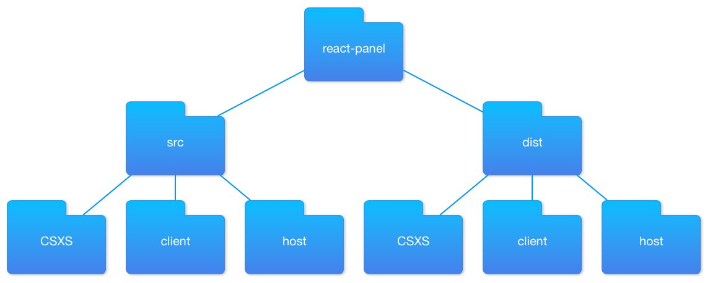

# Scaffolding your project

> **Note:**
>
> If you download the [corresponding code from the sample repository](), the scaffold is already built for you in the [`react-panel`](./react-panel) folder.

## Create the project folder

Let's create the project folder:

```bash
$ mkdir react-panel
$ cd react-panel
```

## Create source and output directories

Now that we've got the project initialized and have installed our dependences, let's create the directory structure.

```bash
# inside react-panel folder
mkdir src
mkdir dist
```

Inside `src`, we need three more directories:

```bash
cd src
mkdir client
mkdir CSXS
mkdir host
```

The above _should_ be familiar to you if you've read the [Getting Started guide](https://github.com/Adobe-CEP/Getting-Started-guides/blob/master/readme.md#1-decide-the-folder-structure).

Inside `dist`, we need the same directories:

```bash
$ cd ../dist
$ mkdir client
$ mkdir CSXS
$ mkdir host
```

When done, we have this directory structure:



> **Important:**
>
> We're creating _two_ identical structures because we have to use a build step that transforms our _source_ (`src/`) files into files that CEP can understand (`dist/`).

Ok, now that we have our project structure created, let's initialize our project so that we can manage dependencies.

[Previous Part](./00-important-concepts.md) | [Next Part](./02-initialize-project.md)
