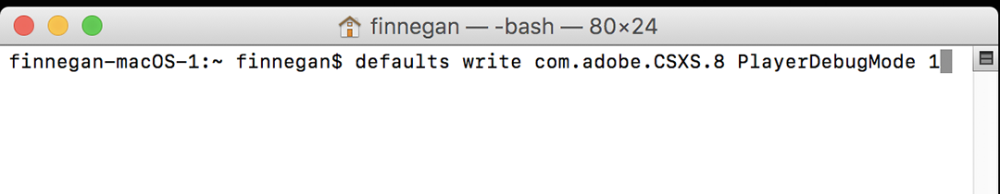
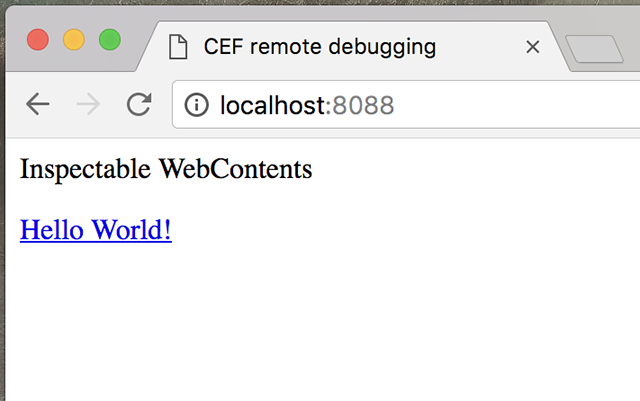
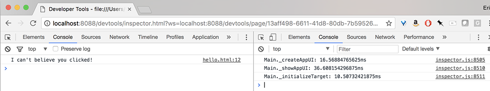
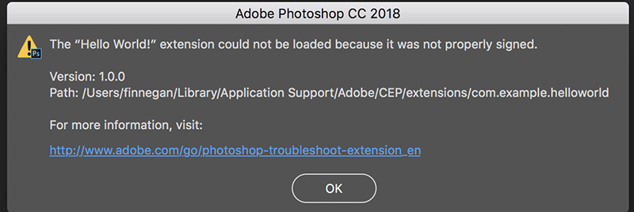

# Client-side debugging

This guide will walk you through the necessary steps to debug client-side code in a CEP extension.

<!-- doctoc command config: -->
<!-- $ doctoc ./readme.md --title "## Contents" --entryprefix 1. --gitlab --maxlevel 2 -->

<!-- START doctoc generated TOC please keep comment here to allow auto update -->
<!-- DON'T EDIT THIS SECTION, INSTEAD RE-RUN doctoc TO UPDATE -->
## Contents

1. [Prerequisites](#prerequisites)
1. [Set the Debug Mode](#set-the-debug-mode)
1. [Create a `.debug` File](#create-a-debug-file)
1. [Write Contents for the `.debug` File](#write-contents-for-the-debug-file)
1. [Debugging in Chrome](#debugging-in-chrome)
1. [Troubleshooting common issues](#troubleshooting-common-issues)
    1. [Getting a "not properly signed" alert](#getting-a-not-properly-signed-alert)
    1. [Getting a blank debug console](#getting-a-blank-debug-console)
1. [Next Steps](#next-steps)
1. [Other Resources](#other-resources)

<!-- END doctoc generated TOC please keep comment here to allow auto update -->

## Prerequisites
This guide will assume that you have completed all steps in the [Getting Started with CEP Extensions Guide](../readme.md).


## Set the Debug Mode
First, set the following Adobe preference to prevent your host application (Photoshop, InDesign, etc.) from throwing alerts about unsigned extensions. The [HTML Extension Cookbook](https://github.com/Adobe-CEP/CEP-Resources/blob/master/CEP_8.x/Documentation/CEP%208.0%20HTML%20Extension%20Cookbook.md) section on [Debugging Unsigned Extensions](https://github.com/Adobe-CEP/CEP-Resources/blob/master/CEP_8.x/Documentation/CEP%208.0%20HTML%20Extension%20Cookbook.md#debugging-unsigned-extensions) explains this process:
> Windows: Open regedit > HKEY_CURRENT_USER/Software/Adobe/CSXS.8, then add a new entry `PlayerDebugMode` of type “`string`” with the value of “`1`”.

> Mac: In the Terminal, type: `defaults write com.adobe.CSXS.8 PlayerDebugMode 1`

 *On Windows, Regedit is located in (C:\Windows\regedit). You can access it using CMD, too.*

*On macOS, Terminal is located in (Applications > Utilities > Terminal).*


## Create a `.debug` File

Next, create a `.debug` file for your extension. The `.debug` file needs to be at the top level of your extension’s folder.


The `.debug` file must be a hidden file in order to work. The `.` at the front of the file name will make it hidden. The easiest way to create this file is to use the code editing tool of your choice (like Sublime Text or Brackets) to create a new file named `.debug`.

To see your hidden files on Mac, as of MacOS Sierra, you can use the `Command Shift +` shortcut.

To see your hidden files on Windows 10, you can expand your view options in a File Explorer window and check the Hidden Files box.

*How to see your hidden files in Windows 10.*

## Write Contents for the `.debug` File

The `.debug` file must include the following elements (see notes **#1-2** below):

```html
    <ExtensionList>
        <!-- 1 -->
        <Extension Id="com.example.helloworld">
           <HostList>

               <!-- 2 -->
               <Host Name="PHXS" Port="8088"/>
               <Host Name="PHSP" Port="8088"/>

            </HostList>
        </Extension>
    </ExtensionList>    
```

1. The Extension ID in this `.debug` file above must match the Extenstion ID in your `manifest.xml` file (see [our Getting Started Guide](https://github.com/Adobe-CEP/Getting-Started-guides/blob/master/readme.md) for more information).

1. List the _Host IDs_ for each app your extension supports, with a corresponding port of your choosing for debugging. In this example, we've listed the Host IDs for Photoshop. [The full list of host application ports is available in the CEP Cookbook](https://github.com/Adobe-CEP/CEP-Resources/blob/master/CEP_8.x/Documentation/CEP%208.0%20HTML%20Extension%20Cookbook.md).


## Debugging in Chrome
Open Chrome and go to `http://localhost:8088/` or whichever port you set in your `.debug` file in the previous section.


*CEF Remote Debugging in Chrome*

If your panel is working, you’ll see the name of your extension as a link you can click on, as seen in the image above. The link will take you to the JavaScript Console within Chromium DevTools. The JavaScript Console is where, among other things, you will see your extension's log and error output.

*The JavaScript Console in Chrome*

In the example below, the `console.log()` message is “I can’t believe you clicked!”. The message originates from the `<script>` element in the `index.html` file:

```html
<html>
<head>
    <title>Hello World!</title>
</head>
<body>

    <h1>Hello World!</h1>

    <!-- Add a button labeled “Click this!” -->
    <button id="myButton">Click this!</button>

    <script type="text/javascript">
    /* Add a click handler to the button */
    document.getElementById('myButton')
        .addEventListener('click', function() {
            /* When the button is clicked, output a string to the JavaScript Console */
            console.log("I can't believe you clicked!");
        });
    </script>

</body>
</html>
```

## Troubleshooting common issues

### Getting a "not properly signed" alert

The change in the [Set the Debug Mode section](#set-the-debug-mode) is invisible if performed correctly. Otherwise, you’ll get the following error about unsigned extensions:

**The “Your Panel Name” extension could not be loaded because it was not properly signed.**

Don’t worry about [signing your extensions](https://github.com/Adobe-CEP/CEP-Resources/blob/master/CEP_8.x/Documentation/CEP%208.0%20HTML%20Extension%20Cookbook.md#signing-extensions) until you’re ready to distribute to users.

If you’ve set the debug mode and are still getting the error above, [try killing the **cfprefsd** process](https://github.com/Adobe-CEP/CEP-Resources/blob/master/CEP_8.x/Documentation/CEP%208.0%20HTML%20Extension%20Cookbook.md#special-notes-for-mac-109-and-higher), or check out this [thread about troubleshooting debug mode](https://forums.adobe.com/thread/2444749) in the Adobe forums.

### Getting a blank debug console
If your debug console in Chrome appears blank, [check the contents of your `.debug` file one more time](#write-contents-for-the-debug-file):

- Does your extension ID in the `.debug` file match what's in `manifest.xml`?
- Are you listing the supported host app(s) correctly with the right Host ID(s)?
- Are you attempting to access `localhost` on the same port that you have indicated in your debug console?

If you are still having trouble, try following [the steps on this Adobe forum thread](https://community.adobe.com/t5/exchange-discussions/debug-console-not-working-correctly/m-p/9608300).

## Next Steps

Now that you've seen the basics, check out these guides and samples that walk you through some common intermediate and advanced topics in building CEP extensions:

- [Exporting files from the host app](../Exporting%20files%20from%20the%20host%20app/readme.md)
- [Network requests and responses with Fetch](../Network%20requests%20and%20responses%20with%20Fetch/readme.md)


## Other Resources
- [CEP Cookbook](https://github.com/Adobe-CEP/CEP-Resources/blob/master/CEP_11.x/Documentation/CEP%2011.1%20HTML%20Extension%20Cookbook.md)
- [CEP Samples repo](https://github.com/Adobe-CEP/Samples)
- [Adobe Photoshop Scripting Reference Docs](https://github.com/Adobe-CEP/CEP-Resources/tree/master/Documentation/Product%20specific%20Documentation/Photoshop%20Scripting)
- [Adobe Illustrator Reference Doc](https://ioconsolerykerprodcdn.azureedge.net/static/installers/ai/scripting/2021/scripting_guide/Illustrator%20Scripting%20Guide.pdf)
- [InDesign Reference Guide](https://github.com/Adobe-CEP/CEP-Resources/blob/master/Documentation/Product%20specific%20Documentation/CEP%20for%20InDesign%20Developers.pdf)
