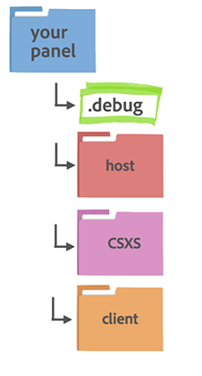
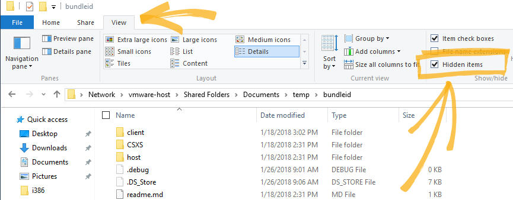
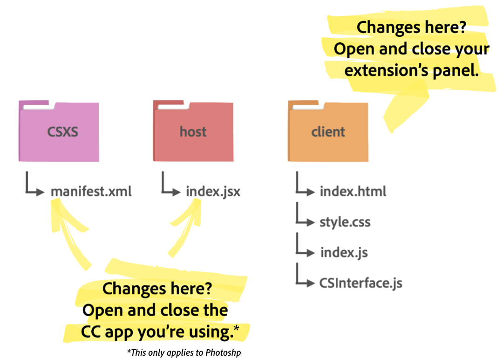

# Debugging Your Adobe Panel

If you've read our [Getting Started with CEP Extenstions Guide](https://github.com/Adobe-CEP/Getting-Started-guides/blob/master/readme.md) and are building your own Adobe panel, you’ll need a way to debug it. In this guide, I’ll walk you through the necessary steps to debug the client-side code for your panel.

This guide is aimed primarily at first time Creative Cloud extension developers, but if you’re a seasoned developer and have some tips to share, let us know in the comments.

We recommend using the latest version of Chrome.

## Set the Debug Mode

But before we can get to Chrome, first, you’ll need to set an Adobe preference to prevent your host application (Photoshop, InDesign, etc.) from throwing alerts about unsigned extensions. The [HTML Extension Cookbook](https://github.com/Adobe-CEP/CEP-Resources/blob/master/CEP_8.x/Documentation/CEP%208.0%20HTML%20Extension%20Cookbook.md) section on [Debugging Unsigned Extensions](https://github.com/Adobe-CEP/CEP-Resources/blob/master/CEP_8.x/Documentation/CEP%208.0%20HTML%20Extension%20Cookbook.md#debugging-unsigned-extensions) tells us how:
> Windows: Openregedit > HKEY_CURRENT_USER/Software/Adobe/CSXS.8, then add a new entry `PlayerDebugMode` of type “`string`” with the value of “`1`”.
> Mac: In the Terminal, type: `defaults write com.adobe.CSXS.8 PlayerDebugMode 1`

If you’re just starting out, opening up Terminal (Applications > Utilities > Terminal) or Regedit (C:\Windows\regedit) might be just outside of your comfort zone, but soon it will be second nature.

*This is what Regedit looks like in Windows 10. You can access it using CMD, too.*

*Here’s what Terminal looks like in MacOS Sierra.*

This change is invisible if you do it right. If you skip this step, or did it wrong, you’ll get the following error about unsigned extensions:

**The “Your Panel Name” extension could not be loaded because it was not properly signed.**

Don’t worry about [signing your extensions](https://github.com/Adobe-CEP/CEP-Resources/blob/master/CEP_8.x/Documentation/CEP%208.0%20HTML%20Extension%20Cookbook.md#signing-extensions) until you’re ready to distribute to users.

If you’ve set the debug mode and are still getting the error above, [try killing the cfprefsd** **process](https://github.com/Adobe-CEP/CEP-Resources/blob/master/CEP_8.x/Documentation/CEP%208.0%20HTML%20Extension%20Cookbook.md#special-notes-for-mac-109-and-higher), or check out this [recent thread about troubleshooting debug mode](https://forums.adobe.com/thread/2444749) in the Adobe forums.

## Create a .debug File

Next, if you want to debug, you’ll have to create a.debug file. The .debug file needs to be at the top level of your panel’s folder.



The .debug file needs to be a hidden file in order to work. This is no big deal if you’re an experienced console user, but for everyone else, it might be a little tricky. Let me show you how.

In MacOS, the easiest way to do this is to either use the code editing tool of your choice (like Sublime Text or Brackets) to create the file, or use the touch command in the Terminal. Since the .debug file is hidden, you’ll only see it if you have hidden files toggled on, or, as of MacOS Sierra, you can use the shortcut Command Shift + to see hidden files.

If you’re using Windows 10, you can name a text file .debug and the . at the front will make it hidden. To see your hidden files, you can expand your view options in a File Explorer window and check the Hidden Files box.

*How to see your hidden files in Windows 10.*

## Write Contents for the .debug File

In the .debug file you can paste in the following (I’ll walk you through the important points below):

```html
    <ExtensionList>
        <Extension Id="com.example.helloworld">
           <HostList>

               /* I’m using Photoshop */
               <Host Name="PHXS" Port="8088"/>

            </HostList>
        </Extension>
    </ExtensionList>    
```

Important points to note:

1. I’m using the same extension ID that I used in my manifest.xml file (see [our Getting Started Guide](https://github.com/Adobe-CEP/Getting-Started-guides/blob/master/readme.md) for more info on the manifest.xml file).

1. Since I’m using Photoshop, I’m using PHXS as the host name. If you’re not using Photoshop, you’ll need to use a different host name. [The full list is available in the documentation](https://github.com/Adobe-CEP/CEP-Resources/blob/master/CEP_8.x/Documentation/CEP%208.0%20HTML%20Extension%20Cookbook.md).

1. I set the port to 8088, but you can use any port you like.

## Open Debugging in Chrome

Now, you can open Chrome and go to http://localhost:8088/ or whichever port you’re using, which you set in your .debug file in the previous section.


*CEF Remote Debugging in Chrome*

If your panel is working, you’ll see a link you can click on, just like in the image above. The link will take you to a mostly blank page. To see some helpful information, click on “View → Developer → JavaScript Console”. Now, if there are errors or console messages, you can see them.

*The JavaScript Console in Chrome*

My console.log() message is “I can’t believe you clicked!”. Here’s the code for it, which all happens to be in my index.html file:

```html
    <html>
    <head>
        <title>Hello World!</title>
    </head>
    <body> 

        /* Create a panel with the title “Hello World!” with a button labeled “Click this!” */
        <h1>Hello World!</h1>
        <button id="myButton">Click this!</button>

        /* The button will listen for a click event, and then display a message in the console. */
        <script type="text/javascript">
        document.getElementById('myButton')
            .addEventListener('click', function(){
                console.log(**"I can't believe you clicked!"**);
            })
        </script>

    </body>
    </html>
```

This assumes everything went well. If your debug console in Chrome appears blank, check your .debug file one more time or try following [the steps on this Adobe forum thread](https://forums.adobe.com/thread/2426224).

## Start Testing

Once you’ve got the debug console working, you’re ready to start testing your panel! Remember the file structure graphic from last week?

*This is true for Photoshop, but in After Effects and Premiere Pro you only need to close and open your panel.*

If you make changes to your index.html or index.js file, you’ll need to open and close your panel within the application (in this case Photoshop) to see the changes. Then, refresh your debugging tab in Chrome.

However, if you make a change in the manifest.xml file, or the index.jsx file, you’ll have to quit out of Photoshop (or whichever application) and relaunch it. Then you’ll have to open a new Chrome tab or window and go to the localhost page again. (You can’t just refresh the previous tab.)

Are you ready to start debugging? Want to learn more about building panels in Adobe Creative Cloud apps? [Head on over to Adobe I/O to get started](https://www.adobe.io/apis/creativecloud/cep.html).
