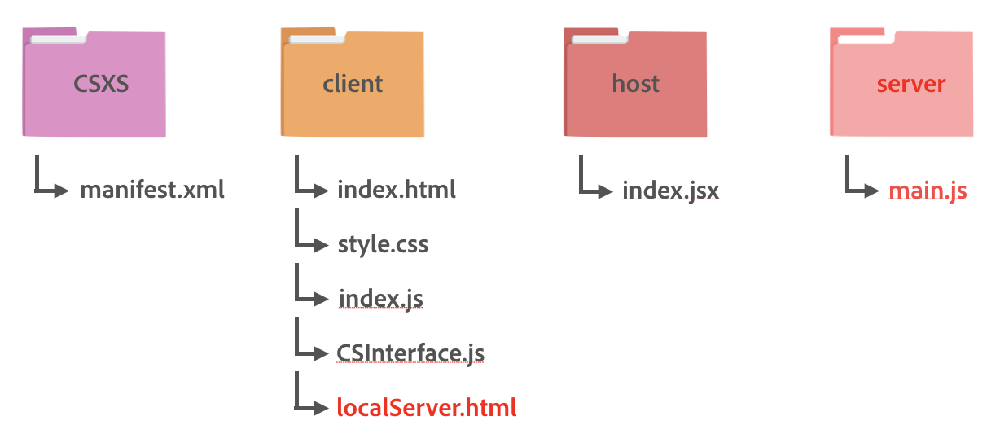

# Importing files from the network
Many Creative Cloud app extensions require the ability to talk to API services on the web. With both Chromium Embedded Framework (CEF) and Node.js at its core, CEP gives you the flexibility to make network calls from within your extension in the way that makes sense for your workflow.

This guide and its companion sample extension will show you how you can create a Node.js-based extension to allow users to retrieve files from an external server/url and load them in Adobe host applications.

By the end of this guide, we will have an Adobe Photoshop extension that:

1. Downloads an image from a url and saves it in a user-specified location on the local machine
1. Loads the image in Photoshop

<!-- doctoc command config: -->
<!-- $ doctoc ./readme.md --title "## Contents" --entryprefix 1. --gitlab --maxlevel 3 -->

<!-- START doctoc generated TOC please keep comment here to allow auto update -->
<!-- DON'T EDIT THIS SECTION, INSTEAD RE-RUN doctoc TO UPDATE -->
## Contents

1. [Technology Used](#technology-used)
1. [Prerequisites](#prerequisites)
1. [Configuration Setup](#configuration-setup)
    1. [Set up the sample extension](#set-up-the-sample-extension)
    1. [Configure `manifest.xml`](#configure-manifestxml)
1. [Client-side: HTML Markup for user-facing extension](#client-side-html-markup-for-user-facing-extension)
1. [Client-side: HTML Markup for Node.js server extension](#client-side-html-markup-for-nodejs-server-extension)
1. [Client-side: Service API interaction](#client-side-service-api-interaction)
    1. [Instantiate `CSInterface`](#instantiate-csinterface)
    1. [Load the second extension for running an Express server](#load-the-second-extension-for-running-an-express-server)
    1. [Create references to the UI elements](#create-references-to-the-ui-elements)
    1. [Add a click handler to the button](#add-a-click-handler-to-the-button)
    1. [Toggling button to show/hide options](#toggling-button-to-showhide-options)
    1. [Getting the local path](#getting-the-local-path)
    1. [Communicating with the server](#communicating-with-the-server)
    1. [Communicate with the host app](#communicate-with-the-host-app)
1. [Host app: Automation with ExtendScript](#host-app-automation-with-extendscript)
    1. [Create an ExtendScript function](#create-an-extendscript-function)
1. [Server-side: Setup](#server-side-setup)
    1. [Install Node.js and npm](#install-nodejs-and-npm)
    1. [Install node modules](#install-node-modules)
    1. [Write server logic in `main.js`](#write-server-logic-in-mainjs)
1. [Troubleshooting and Known Issues](#troubleshooting-and-known-issues)
1. [Other Resources](#other-resources)

<!-- END doctoc generated TOC please keep comment here to allow auto update -->


## Technology Used

- Supported Host Applications: Photoshop
- Libraries/Frameworks/APIs:
    - Adobe-specific: [CEP](https://github.com/Adobe-CEP/CEP-Resources)
    - Other: [jQuery](https://jquery.com/), [Dropbox Auth API](https://www.dropbox.com/developers/reference/oauth-guide)


## Prerequisites
This guide will assume that you have installed all software and completed all steps in the following guides:

- [Getting Started Guide](https://github.com/Adobe-CEP/Getting-Started-guides)

## Folder Structure
If you have a directory structure similar to the one suggested in the [Getting Started Guide](https://github.com/Adobe-CEP/Getting-Started-guides), all you have to add is a folder designated for your server, a Node.js file, a `main.js` file inside the server folder, and another HTML file, `localServer.html`, all under the existing client folder:



The `main.js` file is a Node.js file where write server logic. The root directory can be saved either at the root level or at the user level, depending on who’s allowed to use the extension (refer to the [CEP 8 HTML Extension Cookbook](https://github.com/Adobe-CEP/CEP-Resources/blob/master/CEP_8.x/Documentation/CEP%208.0%20HTML%20Extension%20Cookbook.md#extension-folders) for the exact paths).

Note that except for the required `CSXS` folder, which must contain manifest.xml, the folder structure is flexible.

## Configuration Setup

### Set up the sample extension

The following steps will help you get the sample extension for this guide up and running:

1. Install the `./com.cep.import/` directory in your `extensions` folder. ([See the Cookbook](https://github.com/Adobe-CEP/CEP-Resources/blob/master/CEP_8.x/Documentation/CEP%208.0%20HTML%20Extension%20Cookbook.md#extension-folders) if you are unsure where your `extensions` folder is.)
1. [Download CEP's `CSInterface.js` library](https://github.com/Adobe-CEP/CEP-Resources/blob/master/CEP_8.x/CSInterface.js) and move it to `./com.cep.import/client/js/lib/CSInterface.js`.

After following these steps, you'll be able to run the sample extension within the host apps indicated in the [Technology Used](#technology-used) section of this guide.

### Configure `manifest.xml`

As noted in the [Getting Started guide](https://github.com/Adobe-CEP/Getting-Started-guides), the `manifest.xml` file is where you set various configurations for your panel, such as supported host apps, panel type, CEF parameters, main path, script path, default/minimum/maximum panel size, and others. Refer to the latest version of XML schema in [CEP Github](https://github.com/Adobe-CEP/CEP-Resources/).

**List supported host apps and versions**

The first configuration to set in `manifest.xml` is indicating which Creative Cloud host apps and version numbers your extension supports. For this guide, we'll make an extension that supports Photoshop. So in the `manifest.xml`, make sure you list the supported host names for Photoshop within the `<HostList>` element:

```xml
<!-- ...  -->
<ExecutionEnvironment>
  <HostList>
    <Host Name="PHXS" Version="19.0" />
    <Host Name="PHSP" Version="19.0" />
  </HostList>

  <!-- // ... -->
</ExecutionEnvironment>
<!-- // ... -->
```

Note that the versions indicated in the example code above only target a single version of each host app, for the sake of demo simplicity. Most extension developers will want to target a range of host app versions. To learn how to support multiple host app versions, [see the Cookbook](https://github.com/Adobe-CEP/CEP-Resources/blob/master/CEP_8.x/Documentation/CEP%208.0%20HTML%20Extension%20Cookbook.md#extension-manifest).

**Configure the user-facing extension**

This sample panel is comprised of two separate extensions. However, this does not mean that users will have to load two separate extensions. Only the user-facing panel will be visible to the user while the second extension will be loaded automatically in the background when a simple JavaScript CEP method is called (This will be covered later). Let's configure the user facing extension first.

In the `manifest.xml`, there is a tag called `<ExtensionList>` which lists all extensions used in the panel. Let's list the main extension, which includes the client side and the host application side logic. As configured in `manifest.xml`, this extension will be visible to the user.

```xml
<ExtensionList>
    <Extension Id="com.cep.import.panel" Version="1.0.0" />
</ExtensionList>
```

The next step is to configure details for this main extension, `com.cep.import.panel`. You can insert configurations for this extension by starting with the `<Extension>` tag under the `<DispatchInfoList>` tag:

```xml
<DispatchInfoList>
	<Extension Id="com.cep.import.panel"> 
	...
</DispatchInfoList>
```

Under this tag, you can provide details, such as type, script paths, menu name, and sizes:

```xml
<Extension Id="com.cep.import.panel">
  <DispatchInfo>
    <Resources>
      <MainPath>./client/index.html</MainPath>
      <ScriptPath>./host/index.jsx</ScriptPath>
    </Resources>
    <Lifecycle>
      <AutoVisible>true</AutoVisible>
    </Lifecycle>
    <UI>
      <Type>Panel</Type>
      <Menu>Panel Import Example</Menu>
      <Geometry>
        <Size>
          <Height>500</Height>
          <Width>350</Width>
        </Size>
        <MinSize>
          <Height>200</Height>
          <Width>200</Width>
        </MinSize>
        <MaxSize>
          <Height>600</Height>
          <Width>400</Width>
        </MaxSize>
      </Geometry>
      <Icons />
    </UI>
  </DispatchInfo>
</Extension>
```

Now configurations for the main extension have been set up. The next step is to configure the invisible Node.js server extension.

**Configure the invisible Node.js server extension**

As mentioned above, there are two separate extensions in this sample panel. The purpose of the second extension,`com.cep.import.localserver`, is to set and start the Node.js server.

Let's add this second extension to the `<ExtensionList>` tag.

```xml
<ExtensionList>
	<Extension Id="com.cep.import.panel" Version="1.0.0" />
    <Extension Id="com.cep.import.localserver" Version="1.0.0" />
</ExtensionList>
```

Similar to setting the main extension, you need to configure details for this invisible extension, `com.cep.import.localserver`. Note that you can insert multiple `<Extension>` tags under the `<DispatchInfoList>` tag. You need to simply insert another `<Extension>` tag for this server extension. 

```xml
<Extension Id="com.cep.import.localServer"> 
```

Under this tag, you can provide details, such as type, script paths, menu name, and sizes:

```xml
<Extension Id="com.cep.import.localserver">
  <DispatchInfo>
    <Resources>
      <MainPath>./client/localServer.html</MainPath>
      <CEFCommandLine>
        <Parameter>--enable-nodejs</Parameter>
        <Parameter>--mixed-context</Parameter>
      </CEFCommandLine>
    </Resources>
    <Lifecycle>
      <AutoVisible>false</AutoVisible>
    </Lifecycle>
    <UI>
      <Type>Custom</Type>
      <Geometry>
        <Size>
          <Height>500</Height>
          <Width>350</Width>
        </Size>
      </Geometry>
      <Icons />
    </UI>
  </DispatchInfo>
</Extension>
```

Note that since `com.cep.import.localserver` will be using Node.js, the two parameters, `--enable-nodejs` and `--mixed-context`, are added within `<CEFCommandLine>` as seen above. Also, the `<AutoVisible>` tag is set to `false` and the `<Type>` of the extension is set to `Custom`. This setting makes this server extension invisible to the user.

## Client-side: HTML Markup for user-facing extension

The user interface for CEP extensions is written in HTML. For this sample, you will need to create two HTML documents, one for each extension. Let's create a HTML for the main extension first.

As written in the `<MainPath>` tag of the extension in the `manifest.xml` file, you will find the main HTML located at `./com.cep.import/client/index.html`. This HTML will be loaded and be visible to the user. 

See comments **#1-3**:

```html
<!DOCTYPE html>
<html>
<head>
	<meta charset="utf-8">
	<title>Import Example Panel</title>
</head>
<body>
	<h1>Import Example Panel</h1>

	<!-- 1) Toggle button to show/hide import options -->
	<button id="import-button">Import from external server</button>

	<!-- 2) Buttons for available download options -->
	<div id="download-options" style="display:none">
		<p>Choose your download location</p>
		<button id="documents-button">My Documents</button>
		<button id="extension-button">Panel Folder</button>
	</div>

  	<!-- 3) Your scripts, including the jQuery library and CEP's CSInterface.js library -->
	<script src="https://code.jquery.com/jquery-3.3.1.min.js"></script>
	<script src="js/lib/CSInterface.js"></script>
	<script src="index.js"></script>
</body>
</html>

```

This HTML markup for the main extension, `com.cep.import.panel`, is the HTML page users will see when they first launch your panel.

## Client-side: HTML Markup for Node.js server extension

As written in the `<MainPath>` tag of the server extension, another HTML markup will be loaded from `./com.cep.import/client/localServer.html` in the background and run the `cep_node` method to start the Node.JS server at `/server/main.js`. This HTML will be invisible to users as mentioned above.

_Note: the server extension will load only after the main extension's JavaScript invokes `csInterface.requestOpenExtension()` function. This will be explained shortly in [the later section](#load-the-second-extension-for-running-an-express-server)_

see comments **#1**:

```html
<!DOCTYPE html>
<html>
<head>
	<meta charset="utf-8">
	<script>
	  <!-- 1) This script uses cep_node to start the Express server locaged at '/server/main.js' -->
	    var localServer = cep_node.require(__dirname + '/server/main.js')();
	</script>
	<title>Import Example App</title>
</head>
<body>
</body>
</html>
```

The sole purpose of this HTML markup for the server extension, `com.cep.import.localserver`, is to start the Node.js server. This page will not be visible to users.

## Client-side: Service API interaction
As we saw in the previous section's `index.html` code, the client-side JavaScript for the main extension is located at `./com.cep.import/client/js/index.js`. We will look at this `index.js` file in this section.

### Instantiate `CSInterface`
For any CEP extension, you'll need an instance of `CSInterface`, which, among other things, gives you a way to communicate with the host app's scripting engine:

```javascript
var csInterface = new CSInterface();
```

We'll make use of this `csInterface` constant later on.

### Load the second extension for running an Express server
`csInterface` has a method called `requestOpenExtension`, which opens another extension given an extension ID. In this sample, this method is used to launch the server extension:

```javascript
csInterface.requestOpenExtension("com.cep.import.localserver", "");
```

Simply include the line above in your main extension’s JavaScript file, `client/index.js`. This will open the HTML markup of the invisible server extension. Then, JavaScript written in the HTML markup will start the Node.js server located at `/server/main.js`. Once the second extension is loaded, the Express located at `/server/main.js` will start as written in `/client/localServer.html`.

### Create references to the UI elements
In `index.js`, we'll first reference the elements in our `index.html`:

```javascript
var importButton = document.querySelector("#import-button");
var documentsButton = document.querySelector("#documents-button");
var extensionButton = document.querySelector("#extension-button");
var downloadOptions = document.querySelector("#download-options");
```

We'll work with these UI elements in the next step.

### Add a click handler to the button
We'll add a click handler to the buttons:

```javascript
importButton.addEventListener("click", importToggle);
documentsButton.addEventListener("click", function(){importTo('documents');}, false);
extensionButton.addEventListener("click", function(){importTo('extension');}, false);
```

We'll make the `importToggle()` and `importTo()` helper methods in the next step.

### Toggling button to show/hide options
`importToggle()` helper function simply shows/hides the options and changes the text of the button dynamically.
```
function importToggle() {
    if (downloadOptions.style.display === "none") {
        downloadOptions.style.display = "block";
        importButton.innerText = "Cacel";
    } else {
        downloadOptions.style.display = "none";
        importButton.innerText = "Import from external server";
    }
}
```

### Getting the local path
`CSInterface` has a method called `getSystemPath()` which returns the user's path. In this example, we only use two user paths. Refer to [CSInterface Documentation](https://github.com/Adobe-CEP/CEP-Resources/blob/master/CEP_8.x/CSInterface.js) for other paths.
```
var extensionDirectory = csInterface.getSystemPath("extension");
var documentsDirectory = csInterface.getSystemPath("myDocuments");
```
We will use these directory variables in the following section.

### Communicating with the server
In this sample, `importTo()` uses `jQuery` to communicate with the server. (see comments **#1-6**)
```javascript
function importTo(location) {
	/* 1) Uses the correct variable based on the user's input */
	var directory = location == "documents" ? documentsDirectory : extensionDirectory;
	/* 2) Server import endpoint */
	var url = "http://localhost:3200/import";

	$.ajax({
		type: "GET",
		url: url,
		headers: {
			"directory": directory
		},
		success: response => {
			/* 3) Hide options */
			downloadOptions.style.display = "none";

			/* 4) Change the button text */
			importButton.innerText = "Import from external server";

			/* 5) Show the user where the file was saved */
			alert(`File imported. Location: ${response}`);

			/* 6) Use ExtendScript to show the file in Photoshop */
			csInterface.evalScript(`displayFile("${response}")`);
		},
		error: (jqXHR, textStatus, errorThrown) => {
			console.log("error");
			alert(errorThrown, jqXHR.responseJSON);
		}
	})

}
```

### Communicate with the host app
To communicate with the host app's scripting engine, we'll make use of the `csInterface.evalScript()` method. (If you need a refresher on the `.evalScript()` method, refer to the [Getting Started guide](https://github.com/Adobe-CEP/Getting-Started-guides).)

In this sample app, our `.evalScript()` call will be invoked once we get the response back from the server in the step above. We could interpret the `.evalScript()` call in the code above as meaning:

> Hey host app, call the `displayFile()` function from my ExtendScript file.

We’ll need to make sure that ExtendScript function exists in the next section.

## Host app: Automation with ExtendScript
Many CC host apps like Photoshop and InDesign (and many more) can be automated with ExtendScript. In this sample extension, we're going to simply display the downloaded asset in Photoshop.

Note once again that this sample app is extremely simple for the purpose of focus. ExtendScript provides many deep features to automate work in CC host apps; you can explore more ExtendScript features in our Scripting Guides.

The ExtendScript file for this extension is located at `./com.cep.import/host/index.jsx`.


### Create an ExtendScript function
In the extension's `index.jsx` file, let's create a function called `displayFile()`. (see comments **#1-3**):

```javascript
function displayFile(path) {
	/* 1) First, check if the user is in the supported host app, Photoshop, in this case */
	if (app.name == "Adobe Photoshop") {

		/* 2) Create a file reference */
		var fileRef = new File(path)

		/* 3) Open the file inside Photoshop */
		app.open(fileRef)
	}
}
```

The function runs and displays the downloaded asset in Photoshop. Note that this function does not `return` anything. However, you can write your ExtendScript function to `return` something, which can be captured in a callback like below:

```javascript
csInterface.evalScript('doSomething()', function(value){
	console.log(value)
})
```

## Server-side: Setup
### Install Node.js and npm
[Download and install Node.js and its package manager, npm](https://www.npmjs.com/get-npm), and make sure you have the `package.json` file in the root level directory of your panel.

### Install node modules
Make sure to install all node dependencies required by this extension.
```
npm install
```

### Write server logic in `main.js`
This sample extension uses `express` and `http` to set up a server. Make sure to the same port, in this case, `3000`. While this example simply downloads an image from a url, you can imagin you can modifiy this to hit other APIs or your own server to retrieve data. (see comments **#1-4**):

```
app.get("/import", (req, res, next) => {

	/* 1) Grab the desired directory from the headers and insert the default image name */
	var path = req.headers["directory"] + "/placeholder.png"

	/* 2) Note this uri variable can be a server endpoint as well */
	var uri = "http://via.placeholder.com/350x150";

	download(uri, path, function(){
		/* 3) Once download is completed, send the path to the client side */
		res.status(200).send(path)
	});

	/* 4) Helper function to download the asset using the fs module */
	var download = function(uri, filepath, callback){
		request.head(uri, function(err, res, body){
			request(uri).pipe(fs.createWriteStream(filepath)).on('close', callback);
		});
	};

});
```

After saving the file, the server simply responds with the path of the file, which is eventually used by `index.jsx` to load the image in Photoshop.

## Troubleshooting and Known Issues
Articles about common issues are [here](!LINK).

You can submit tickets for bugs and feature requests [here](!LINK).

## Other Resources
- [CEP Cookbook](https://github.com/Adobe-CEP/CEP-Resources/blob/master/CEP_8.x/Documentation/CEP%208.0%20HTML%20Extension%20Cookbook.md)
- [Photoshop ExtendScript](https://www.adobe.com/devnet/photoshop/scripting.html)
