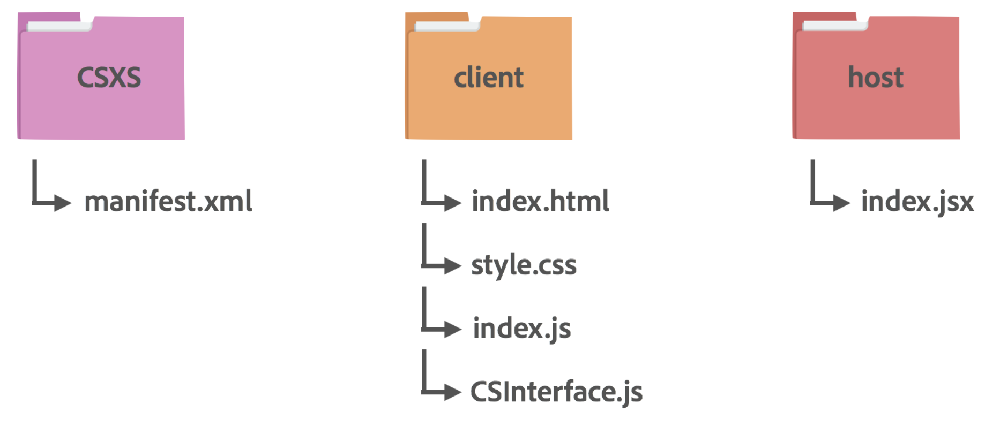

# Package, Distribute, Install Guide

After you have successfully built your extension, you should package the extension in the `ZXP` format and sign the extension with a valid certificate in order to distribute your extension properly. This guide will walk you through the process of packaging, distributing, and installing your extension.

By the end of this guide, you will be able to:

1. Package your extension in the `ZXP` format with a certificate
1. Install the packaged extension in your or others' machine
1. Distribute the packaged extension

<!-- doctoc command config: -->
<!-- $ doctoc ./package-install-guide.md --title "## Contents" --entryprefix 1. --gitlab --maxlevel 2 -->

<!-- START doctoc generated TOC please keep comment here to allow auto update -->
<!-- DON'T EDIT THIS SECTION, INSTEAD RE-RUN doctoc TO UPDATE -->
## Contents

1. [Prerequisites](#prerequisites)
1. [Signing your extension](#signing-your-extension)
1. [Creating and verifying a signed package](#creating-and-verifying-a-signed-package)
1. [Distributing the `ZXP` Packaged Extension within Adobe](#distributing-the-zxp-packaged-extension-within-adobe)
1. [Installing the `ZXP` Packaged Extension](#installing-the-zxp-packaged-extension)

<!-- END doctoc generated TOC please keep comment here to allow auto update -->

## Prerequisites
This guide assumes that you have a finished, working version of an CEP extension. If you have not built an CEP extension yet, make sure to visit [Adobe CEP Getting Started Guide](https://github.com/Adobe-CEP/Getting-Started-guides).

## Signing your extension
The signature verifies that the package has not been altered since it was packaged. When installing a package, your extension installer validates the package against the signature, and checks for a valid certificate. In addition, CEP checks for a valid certificate each time a host application tries to run an extension.

Certificates used to cryptographically sign documents or software commonly have expiration options between one and four years. If the certificate has no valid timestamp, and the certificate used to sign the extension has expired, the extension cannot be installed or loaded. There is no warning or notification to the user before the signature expires. To make your extension available to users again, you would have to repackage it with a new certificate. Thus, it is recommended to repackage the extension well before your installer certificate is due to expire to avoid users being unable to install your extension.

A valid timestamp ensures that the certificate used to sign the extension was valid at the time of signing.
For this reason, you should always add a timestamp to the signature when you package and sign your
extension. A timestamp has the effect of extending the validity of the digital signature.

These are the possible validation results:

| Signature | CEP result |
| --------- | :--------- |
| No signature | Extension does not run |
| Signature invalid | Extension does not run |
| Certificate used to sign has expired and no timestamp exists | Extension does not run |
| Certificate used to sign has expired, but has a valid timestamp | Extension runs normally |
| Signature valid | Extension runs normally|

### Download the signing and packaging tool, `ZXPSignCmd`
Adobe provides a command-line tool, `ZXPSignCmd`, that you can use to package and sign extensions. Access the [CEP Resources page](https://github.com/Adobe-CEP/CEP-Resources/tree/master/ZXPSignCMD) to download the toolkit for your platform. 

You can use this tool to create a self-signed certificate, create a signed ZXP package, or verify an existing ZXP package. Note that this tool does not validate the content of your extension. 

If you are unfamiliar with the required structure and content of the extension, refer to [Adobe CEP Getting Started Guide](https://github.com/Adobe-CEP/Getting-Started-guides).

### Decide how to sign your extension
There are two types of code-signing certificate: commercial certificates provided by a trusted certificate authority, and self-signed certificates. Commercial certificates must be purchased from a trusted certificate authority.

- Using CA (Certificate Authority) - Your certificate signed by CA must satisfy these conditions:
	- The root certificate of the code-signing certificate must be installed in the target operating system by
default. This can vary with different variations of an operating system.

	- The issuing certificate authority (CA) of the code-signing certificate must permit you to use that
certificate to sign extensions.

- Creating a self-signed certificate - If you do not have an existing certificate signed by CA, you can self-sign your package by using `ZXPSignCmd` downloaded in the previous step by running the following command:

```
ZXPSignCmd -selfSignedCert <countryCode> <stateOrProvince> <organization> <commonName> <password> <outputPath.p12> [options]
```

| Parameters       | Description                                             | 
| -------------    |:--------------------------------------------------------| 
| countryCode      | The certificate identifying information for your country.| 
| stateOrProvince  | The certificate identifying information for your state or providence.| 
| organization     | The certificate identifying information for your organization.| 
| commonName       | The certificate identifying information for your common name.| 
| password         | The password for the new certificate.|
| outputPath.p12   | The path and file name for the new certificate.| 
| options(locality)| `-locality <code>` If supplied, the locale code to associate with this certificate.| 
| options(orgUnit) | `-orgUnit <name>` If supplied, an organizational unit to associate with this certificate.| 
| options(email)   | `-email <addr>` If supplied, an email address to associate with this certificate.| 
| options(validityDays)| `-validityDays <num>` If supplied, a number of days from the current date-time that this certificate remains valid.| 

Once you run the command, this will output the self-signed certificate at the specified `<outputPath.p12>`.

**Example**
```
./ZXPSignCmd -selfSignedCert US NY MyCompany MyCommonName abc123 MyCert.p12
```

## Creating and verifying a signed package
Once you have a signed, verified certificate from the previous step, you are ready to create a signed pacakge. In order to conform to the Adobe Exchange requirements or distribute using the Admin Console, you must create an Adobe `ZXP` package. If you aren't distributing on Adobe Exchange or the Admin Console, ZXP may not be required. Check with your distribution channel for details.

### Decide what to include in your package and provide the configuration file
If your package only includes one HTML extension, you can construct your folder structure like below and include an XML file named `manifest.xml` inside the `CSXS`folder:



And here is an example `manifest.xml` based on the folder structure above:

```
<?xml version="1.0"?>
<ExtensionManifest xmlns:xsi="http://www.w3.org/2001/XMLSchema-instance"
  ExtensionBundleId="com.example.extension"
  ExtensionBundleVersion="1.0.0" Version="7.0">
  <ExtensionList>
    <Extension Id="com.example.extension.panel" Version="1.0.0"/>
  </ExtensionList>
  <ExecutionEnvironment>
    <HostList>
        <Host Name="PHXS" Version="14.0" />
        <Host Name="PHSP" Version="14.0" /
    </HostList>
    <LocaleList>
      <Locale Code="All"/>
    </LocaleList>
    <RequiredRuntimeList>
      <RequiredRuntime Name="CSXS" Version="7.0"/>
    </RequiredRuntimeList>
  </ExecutionEnvironment>
  <DispatchInfoList>
    <Extension Id="com.example.extension.panel">
      <DispatchInfo>
        <Resources>
          <MainPath>./client/index.html</MainPath>
          <ScriptPath>./host/index.jsx</ScriptPath>
          <CEFCommandLine/>
        </Resources>
        <Lifecycle>
          <AutoVisible>true</AutoVisible>
        </Lifecycle>
        <UI>
          <Type>Panel</Type>
          <Menu>Example Extension</Menu>
          <Geometry>
            <Size>
              <Height>500</Height>
              <Width>350</Width>
            </Size>
          </Geometry>
          <Icons/>
        </UI>
      </DispatchInfo>
    </Extension>
  </DispatchInfoList>
</ExtensionManifest>
```
_SEE: [complete version of the manifest spec](https://github.com/Adobe-CEP/CEP-Resources/blob/master/CEP_8.x/ExtensionManifest_v_7_0.xsd)_

If you want to include other files and/or provide additional configurations, you must provide a configuration `.mxi` file, where you can specify all of the configuration details for the product, such as where to install files, which applications are supported, and so on. See below for the recommended folder structure:


And here is an example `id.xml` based on the folder structure above:

```
<?xml version="1.0" encoding="UTF-8"?>
<macromedia-extension
    id="id"
    icon="icon.png"
    name="Example Package"
    requires-restart="true"
    version="1.0.0">
    <author name="AUTHOR NAME"/>
    <description>
        <![CDATA[YOUR DESCRIPTION]]>
    </description>
    <ui-access>
        <![CDATA[YOUR INSTRUCTION]]>
    </ui-access>
    <license-agreement>
        <![CDATA[YOUR LICENSE AGREEMENT]]>
    </license-agreement>
    <products>
        <product familyname="Photoshop" version="13"/>
    </products>
    <files>
        <file source="Extension/html.zxp"
            destination=""
            file-type="CSXS"
            products="Photoshop,Photoshop32,Photoshop64"
            minVersion="14.0" />
        <file source="PSD/"
            destination="$Downloads"
            file-type="ordinary"
            products="Photoshop,Photoshop32,Photoshop64"
            minVersion="14.0" />
    </files>
</macromedia-extension>

```
_SEE: [Configuration File Reference](https://helpx.adobe.com/extension-manager/kb/configuration-file-reference.html)_

### Use `ZXPSignCmd` to package your HTML extension
Once you have the input directory ready, run the following command to finish packaging:

```
ZXPSignCmd -sign <inputDir> <outputZxp> <p12> <p12Password> [options]
```

| Parameters       | Description                                             | 
| -------------    |:--------------------------------------------------------| 
| inputDir      | The path to the folder containing the source files to package.| 
| outputZxp  | The path and file name for the ZXP package.| 
| p12| The path and file name for the signed certificate.|
| p12Password | The password for the certificate.| 
| options(tsa)   | `-tsa <timestampURL>` The timestamp server. Examples:<br>http://time.certum.pl/<br>http://timestamp.comodoca.com/rfc3161| 

**Example**
```
./ZXPSignCmd -sign myExtProject myExtension.zxp MyCert.p12 abc123 -tsa http://time.certum.pl/
```

### Use `ZXPSignCmd` to verify your `ZXP` Package
Note that `ZXPSignCmd` does not verify the content of your extension but only verifies the signature of your `ZXP` package.
Run the following command to verify the signature:
```
ZXPSignCmd -verify <zxp>|<extensionRootDir> [options]
```

| Parameters       | Description                                             | 
| -------------    |:--------------------------------------------------------| 
| zxp      | The path and file name for the ZXP package.| 
| extensionRootDir  | The path to the folder containing the deployed ZXP| 
| options(certinfo)| `-certinfo` If supplied, prints information about the certificate, including timestamp and revocation information.|
| options(skipOnlineRevocationChecks) | `-skipOnlineRevocationChecks` If supplied, skips online checks for certificate revocation when `-certinfo` is set.| 
| options(addCerts)   | `-addCerts <cert1> <cert2> ...` If supplied, verifes the certificate chain and assesses whether the supplied DER-encoded certificates are included.| 

**Example**
```
./ZXPSignCmd -verify myExtension.zxp -certinfo

*********** Certificate Information ***********
CN: MyCommonName
OU: 
DN: /C=US/ST=NY/O=MyCompany/CN=MyCommonName
OS Trusted: false
Revoked: false
Timestamp: Valid and within certificate validity dates at time of signing
Signing Certificate: Valid (from 2018-04-02 until 2029-06-19)
***********************************************
```
_Note: You can check the validity of your timestamp like above_

## Distributing the `ZXP` Packaged Extension
There are numerous options for developers to distribute extensions. In this section, we'll note two options preferred by Adobe. If you opt for another method of distributing, check with that distribution channel for details.
### Option #1 - Adobe Exchange
You can distribute your package to the public via the Adobe Exchange where Adobe users can download your extension. In order to list your extension, visit the [Producer Portal](https://technologypartners.adobe.com/home.html#). If you need further help, check out the [New Adobe Exchange Producer Portal article](https://medium.com/adobe-io/adobe-exchange-producer-portal-4f7af3d5f6fe). 

### Option #2 - Multiple User Deployment in Managed Environments
The enterprise console allows you to bundle extensions into the deployment package. This means installation of your Creative Cloud applications and installation of your extensions happens as part of a single deployment process. Please take a look at the following steps:
1. Login to [the enterprise console](https://adminconsole.adobe.com/enterprise/overview)
1. Navigate to "Packages" tab at the top
1. Click "Create a Package"
1. Select "Managed Package" and click "Select"
1. Configure your package and click "Next" (make sure to check "Create a folder for extensions & include the Extension Manager command line tool")
1. Include any other Adobe host applications if necessary and click "Next"
1. Enter the package name and click "Build Package"
1. Your browser will automatically download the package when ready. If not, click on your package name and click "Download"
1. Unzip the donwloaded zip file (Note: if you are using MacOS, make sure to unzip it using the MacOS built-in Archive Utility)
1. Open the unzipped folder and navigate to the `Build` folder
1. Right click on the `YOUR_PACKAGE_NAME.pkg` file and select "Show Package Content"
1. Navigate to `Contents > Resources > post > addon > ZXP`
1. Save your `.zxp` file in this folder
1. Navigate back to `YOUR_PACKAGE_NAME.pkg` and double-click the `.pkg` file. Installation process will kick-off

## Installing the `ZXP` Packaged Extension
### Option #1 - Adobe Exchange
Adobe Exchange is a marketplace where you can upload and download extensions, custom tags, scripts, content, and other items that extend the functionality of Adobe applications. In order to download a Adobe Exchange hosted product, simply follow the instructions below:

1. Visit https://www.adobeexchange.com/
1. Choose the marketplace (Creative Cloud / Experience Cloud / Document Cloud)
1. Choose the product that fits your need
1. Click on the "Buy" or "Free" button, depending on whether the product is free or not
1. The product will be downloaded in the appropriate location (Note that the download location is specified in the ZXP package. Most sellers include the download location in the "Where 
To Find It" section)

### Option #2 - `ExManCmd`
1. Download `ExManCmd` - Download the Extension Manager Command Line tool (ExManCmd) from the following locations (You can use the command line to perform various operations you would normally perform in the Extension Manager workspace):
    - [ExManCmd - Mac](http://www.adobeexchange.com/ExManCmd_mac.zip)
    - [ExManCmd - Windows](http://www.adobeexchange.com/ExManCmd_win.zip)

1. Unzip the `ExManCmd` toolkit - Unzip the downloaded toolkit and have the `ExManCmd` file available for use in the next step.

1. Install the package - You can easily install/uninstall the package using the available commands in `ExManCmd`. Refer to [Extension Manager command-line basics](https://helpx.adobe.com/extension-manager/using/command-line.html) for more details.

    ```
    ExManCmd --install <zxpPath>
    ```

    **Example**
    ```
    ./ExManCmd --install ~/Documents/myExtension.zxp
    ```
    If you get an error, see the [extensions installation error codes and description](https://helpx.adobe.com/exchange/kb/error-codes.html) for more information.

### Option #3 - Anastasiy’s extension manager
Anastasiy’s extension manager is a third-party developed tool that can help you install extensions packaged in `.zxp` format. 

1. Download and install Anastasiy’s extension manager
    Visit [Anastasiy's extension manager download page](https://install.anastasiy.com/) and follow the instructions.

    After the installation is completed, your extension will be stored at the root level of the extension folder (Note that the root extension folder location is different depending on which OS you use. See [CEP Cookbook](https://github.com/Adobe-CEP/CEP-Resources/blob/master/CEP_8.x/Documentation/CEP%208.0%20HTML%20Extension%20Cookbook.md#extension-folders) for more details.)
