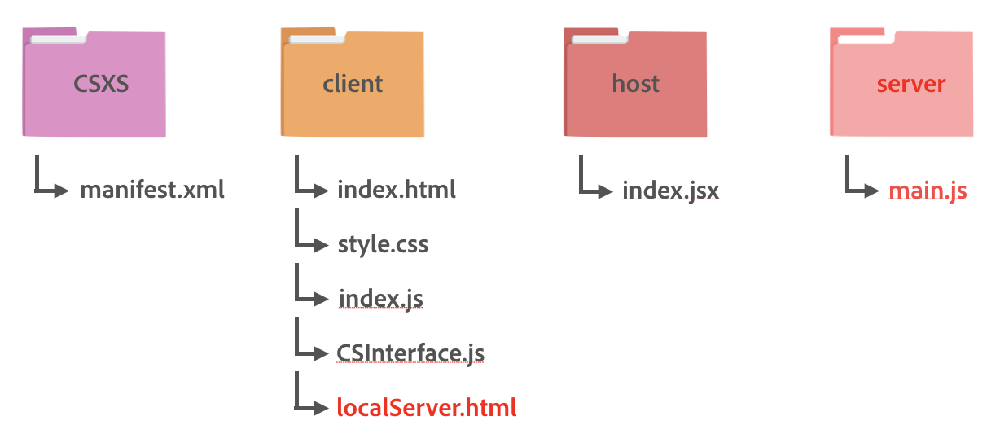

# panel-thirdparty-auth-example-app

Many Creative Cloud app extensions require the ability to talk to API services on the web. With both Chromium Embedded Framework (CEF) and Node.js at its core, CEP gives you the flexibility to make network calls from within your extension in the way that makes sense for your workflow

This sample panel is built to show developers how they can create a Node JS and Express JS based panel to allow users to authenticate using a third party auth (Dropbox in this example) and make basic API calls.

By the end of this guide, we will have a panel that:

1. lets users authenticate using their Dropbox credentials
1. makes simple Dropbox API calls like retrieving basic user info using the token retrieved from step #1

<!-- doctoc command config: -->
<!-- $ doctoc ./readme.md --title "**Contents**" --entryprefix 1. --gitlab --maxlevel 2 -->

<!-- START doctoc generated TOC please keep comment here to allow auto update -->
<!-- DON'T EDIT THIS SECTION, INSTEAD RE-RUN doctoc TO UPDATE -->
**Contents**

1. [Technology Used](#technology-used)
1. [Prerequisites](#prerequisites)
1. [Folder Structure](#folder-structure)
1. [Configuration Setup](#configuration-setup)
1. [Client-side: HTML Markup for user-facing extension](#client-side-html-markup-for-user-facing-extension)
1. [Client-side: HTML Markup for Node.js server extension](#client-side-html-markup-for-nodejs-server-extension)
1. [Client-side: Service API interaction](#client-side-service-api-interaction)
1. [Server-side Setup](#server-side-setup)

<!-- END doctoc generated TOC please keep comment here to allow auto update -->

## Technology Used
- Supported Host Applications: Photoshop, Illustrator, Indesing, Premier Pro
- Libraries/Frameworks/APIs:
    - Adobe-specific: [CEP](https://github.com/Adobe-CEP/CEP-Resources)
    - Other: [jQuery](https://jquery.com/), [Dropbox Auth API](https://www.dropbox.com/developers/reference/oauth-guide)

## Prerequisites
This guide will assume that you have installed all software and completed all steps in the following guides:

- [Getting Started](../readme.md)

## Folder Structure
If you have a directory structure similar to the one suggested in the [Getting Started Guide](https://github.com/Adobe-CEP/Getting-Started-guides), all you have to add is a folder designated for your server, a Node.js file, a `main.js` file inside the server folder, and another HTML file, `localServer.html`, all under the existing client folder:



The `main.js` file is a Node.js file where write server logic. The root directory can be saved either at the root level or at the user level, depending on who’s allowed to use the extension (refer to the [CEP 8 HTML Extension Cookbook](https://github.com/Adobe-CEP/CEP-Resources/blob/master/CEP_8.x/Documentation/CEP%208.0%20HTML%20Extension%20Cookbook.md#extension-folders) for the exact paths).

Note that except for the required `CSXS` folder, which must contain manifest.xml, the folder structure is flexible.

## Configuration Setup
### Set up to sample extension
The following steps will help you get the sample extension for this guide up and running:

1. Install the `./com.cep.auth/` directory in your `extensions` folder. ([See the Cookbook](https://github.com/Adobe-CEP/CEP-Resources/blob/master/CEP_8.x/Documentation/CEP%208.0%20HTML%20Extension%20Cookbook.md#extension-folders) if you are unsure where your `extensions` folder is.)
1. [Download CEP's `CSInterface.js` library](https://github.com/Adobe-CEP/CEP-Resources/blob/master/CEP_8.x/CSInterface.js) and move it to `./com.cep.auth/client/js/lib/CSInterface.js`.
1. [Register your app for Dropbox](https://www.dropbox.com/developers/apps/create)
	1. Add the redirect URI configured for this app - `http://localhost:3000/gcallback`
	1. Get the API Key and Secret
1. Find `config.js` at this path: `./com.cep.auth/client/js/config.js`.
1. In `config.js` file, substitute the default strings with your credentials:

```javascript
const CLIENT_ID = "YOUR_DROPBOX_CLIENT_ID";
const CLIENT_SECRET = "YOUR_DROPBOX_SECRET";
```

After following these steps, you'll be able to run the sample extension within the host apps indicated in the [Technology Used](#technology-used) section of this guide.

### Configure `mainfest.xml`
As noted in the [Getting Started guide](https://github.com/Adobe-CEP/Getting-Started-guides), the `manifest.xml` file is where you set various configurations for your panel, such as supported host apps, panel type, CEF parameters, main path, script path, default/minimum/maximum panel size, and others. Refer to the latest version of XML schema in [CEP Github](https://github.com/Adobe-CEP/CEP-Resources/).

**List supported host apps and versions**

The first configuration to set in `manifest.xml` is indicating which Creative Cloud host apps and version numbers your extension supports. For this guide, we'll make an extension that supports Photoshop. So in the `manifest.xml`, make sure you list the supported host names for Photoshop within the `<HostList>` element:

```xml
<!-- ...  -->
<ExecutionEnvironment>
  <HostList>
    <Host Name="PHXS" Version="19.0" />
    <Host Name="PHSP" Version="19.0" />
  </HostList>

  <!-- // ... -->
</ExecutionEnvironment>
<!-- // ... -->
```

Note that the versions indicted in the example code above only target a single version of each host app, for the sake of demo simplicity. Most extension developers will want to target a range of host app versions. To learn how to support multiple host app versions, [see the Cookbook](https://github.com/Adobe-CEP/CEP-Resources/blob/master/CEP_8.x/Documentation/CEP%208.0%20HTML%20Extension%20Cookbook.md#extension-manifest).

**Configure the user-facing extension**

This sample panel is comprised of two separate extensions. However, this does not mean that users will have to load two separate extensions. Only the user-facing panel will be visible to the user while the second extension will be loaded automatically in the background when a simple JavaScript CEP method is called (This will be covered later). Let's configure the user facing extension first.

In the `manifest.xml`, there is a tag called `<ExtensionList>` which lists all extensions used in the panel. Let's list the main extension, which includes the client side and the host application side logic. As configured in `manifest.xml`, this extension will be visible to the user.

```xml
<ExtensionList>
    <Extension Id="com.cep.auth.panel" Version="1.0.0" />
</ExtensionList>
```

The next step is to configure details for this main extension, `com.cep.auth.panel`. You can insert configurations for this extension by starting with the `<Extension>` tag under the `<DispatchInfoList>` tag:

```xml
<DispatchInfoList>
	<Extension Id="com.cep.auth.panel"> 
	...
</DispatchInfoList>
```

Under this tag, you can provide details, such as type, script paths, menu name, and sizes:

```xml
<Extension Id="com.cep.auth.panel">
  <DispatchInfo>
    <Resources>
      <MainPath>./client/index.html</MainPath>
      <ScriptPath>./host/index.jsx</ScriptPath>
    </Resources>
    <Lifecycle>
      <AutoVisible>true</AutoVisible>
    </Lifecycle>
    <UI>
      <Type>Panel</Type>
      <Menu>Panel Auth Example</Menu>
      <Geometry>
        <Size>
          <Height>500</Height>
          <Width>350</Width>
        </Size>
        <MinSize>
          <Height>200</Height>
          <Width>200</Width>
        </MinSize>
        <MaxSize>
          <Height>600</Height>
          <Width>400</Width>
        </MaxSize>
      </Geometry>
      <Icons />
    </UI>
  </DispatchInfo>
</Extension>
```

Now configurations for the main extension have been set up. The next step is to configure the invisible Node.js server extension.

**Configure the invisible Node.js server extension**

As mentioned above, there are two separate extensions in this sample panel. The purpose of the second extension,`com.cep.auth.localserver`, is to set and start the Node.js server.

Let's add this second extension to the `<ExtensionList>` tag.

```xml
<ExtensionList>
	<Extension Id="com.cep.auth.panel" Version="1.0.0" />
    <Extension Id="com.cep.auth.localserver" Version="1.0.0" />
</ExtensionList>
```

Similar to setting the main extension, you need to configure details for this invisible extension, `com.cep.auth.localserver`. Note that you can insert multiple `<Extension>` tags under the `<DispatchInfoList>` tag. You need to simply insert another `<Extension>` tag for this server extension. 

```xml
<Extension Id="com.cep.auth.localServer"> 
```

Under this tag, you can provide details, such as type, script paths, menu name, and sizes:

```xml
<Extension Id="com.cep.auth.localserver">
  <DispatchInfo>
    <Resources>
      <MainPath>./client/localServer.html</MainPath>
      <CEFCommandLine>
        <Parameter>--enable-nodejs</Parameter>
        <Parameter>--mixed-context</Parameter>
      </CEFCommandLine>
    </Resources>
    <Lifecycle>
      <AutoVisible>false</AutoVisible>
    </Lifecycle>
    <UI>
      <Type>Custom</Type>
      <Geometry>
        <Size>
          <Height>500</Height>
          <Width>350</Width>
        </Size>
      </Geometry>
      <Icons />
    </UI>
  </DispatchInfo>
</Extension>
```

Note that since `com.cep.auth.localserver` will be using Node.js, the two parameters, `--enable-nodejs` and `--mixed-context`, are added within `<CEFCommandLine>` as seen above. Also, the `<AutoVisible>` tag is set to `false` and the `<Type>` of the extension is set to `Custom`. This setting makes this server extension invisible to the user.

## Client-side: HTML Markup for user-facing extension
The user interface for CEP extensions is written in HTML. For this sample, you will need to create two HTML documents, one for each extension. Let's create a HTML for the main extension first.

As written in the `<MainPath>` tag of the extension in the `manifest.xml` file, you will find the main HTML located at `./com.cep.auth/client/index.html`. This HTML will be loaded and be visible to the user. 

see comments **#1-3**:

```html
<!DOCTYPE html>
<html>
<head>
	<meta charset="utf-8">
	<title>Dropbox Example App</title>
	<link rel="stylesheet" type="text/css" href="css/style.css">
</head>
<body>
	<h1>Dropbox Example App</h1>

  	<!-- 1) buttons -->
	<div id="button-group">
		<button id="login-button">Log in with Dropbox</button>
		<button id="user-button">Get user info</button>
	</div>

  	<!-- 2) An empty div -->
	<div id="canvas">
	</div>

  	<!-- 3) Your scripts, including JQuery library and CEP's CSInterface.js library  -->
	<script src="https://code.jquery.com/jquery-3.3.1.min.js"></script>
	<script type="text/javascript" src="js/lib/CSInterface.js"></script>
	<script type="text/javascript" src="js/index.js"></script>
</body>
</html>
```

## Client-side: HTML Markup for Node.js server extension

As written in the `<MainPath>` tag of the server extension, another HTML markup will be loaded from `./com.cep.auth/client/localServer.html` in the background and run the `cep_node` method to start the Node.JS server at `/server/main.js`. This HTML will be invisible to users as mentioned above.

_Note: the server extension will load only after the main extension's JavaScript invokes `csInterface.requestOpenExtension()` function. This will be explained shortly in [the later section](#load-the-second-extension-for-running-an-express-server)_

see comments **#1**:

```html
<!DOCTYPE html>
<html>
<head>
	<meta charset="utf-8">
	<script>
	  <!-- 1) This script uses cep_node to start the Express server locaged at '/server/main.js' -->
	    var localServer = cep_node.require(__dirname + '/server/main.js')();
	</script>
	<title>Dropbox Example App</title>
</head>
<body>
</body>
</html>
```

The sole purpose of this HTML markup for the server extension, `com.cep.import.localserver`, is to start the Node.js server. This page will not be visible to users.

## Client-side: Service API interaction
As we saw in the previous section's `index.html` code, the client-side JavaScript for this extension is located at `./com.cep.auth/client/js/index.js`. We will look at this `index.js` file in this section.

### Instantiate `CSInterface`

For any CEP panel, you'll need an instance of `CSInterface`, which, among other things, gives you a way to communicate with the host app's scripting engine:

```javascript
var csInterface = new CSInterface();
```

We'll make use of this `csInterface` constant later on.

### Load the second extension for running an Express server
`csInterface` has a method called `requestOpenExtension`, which opens another extension given an extension ID. In this sample, this method is used to launch the server extension:

```javascript
csInterface.requestOpenExtension("com.cep.auth.localserver", "");
```

Simply include the line above in your main extension’s JavaScript file, `client/index.js`. This will open the HTML markup of the invisible server extension. Then, JavaScript written in the HTML markup will start the Node.js server located at `/server/main.js`. Once the second extension is loaded, the Express located at `/server/main.js` will start as written in `/client/localServer.html`.

### Create references to the UI elements
In `index.js`, we'll first reference the elements in our `index.html`:

```javascript
var loginButton = document.querySelector("#login-button");
var userButton = document.querySelector("#user-button");
var canvas = document.querySelector("#canvas");
```

We'll work with these UI elements in the next step.

### Add a click handler to the button
We'll add a click handler to the buttons:

```javascript
loginButton.addEventListener("click", login);
userButton.addEventListener("click", getUserInfo);
```

We'll make the `login()` and `getUserInfo()` helper methods in the next step.

### Communicating with the server
In this sample, `jQuery` is used to communicate with the server. (see comments **#1-3**:)
```javascript
function login() {
	$.ajax({
		type: "GET",
	  	/* 1) Make sure to target the correct port, `3000` in this case, 
	  	and do include the entire url, `http://localhost...` */
		url: "http://localhost:3000/glogin",
		success: response => {
	  	/* 2) Server will respond with the auth url, which is used to redirect the user to */
			window.location.href = response;
		},
		error: (jqXHR, textStatus, errorThrown) => { 
			console.log("error");
			alert(JSON.parse(jqXHR.responseText).error);
		}
	})
}

function getUserInfo() {
	$.ajax({
		type: "GET",
		url: "http://localhost:3000/user",
		success: response => {
	  	/* 3) Server will respond with the user's profile data, which will be displayed in the UI*/ 
			canvas.innerHTML = JSON.stringify(response.data);
		},
		error: (jqXHR, textStatus, errorThrown) => { 
			console.log("error");
			alert(JSON.parse(jqXHR.responseText).error);
		}
	})

}
```

## Server-side Setup
### Install Node.js and npm
[Download and install Node.js and its package manager, npm](https://www.npmjs.com/get-npm), and make sure you have the `package.json` file in the root level directory of your panel.

### Install node modules
Make sure to install all node dependencies required by this panel.
```
npm install
```

### Write server logic in `main.js`
This sample panel uses `express` and `http` to set up a server. Make sure to use the same port, in this case, `3000`. All of the following endpoints use `axios` library to make API calls.
- `/glogin` endpoint simple constructs the url to hit Dropbox auth endpoint and sends it to the client-side which will redirect to the url.
- `/gcallback` endpoint is designed to receive callback from Dropbox after user successfully gives consent to the app and to retrive `access_token` which is required for making further API calls to Dropbox.
- `/user` endpoint uses the token received from `/gcallback` and sends an API call to Dropbox to retrive user's information.
